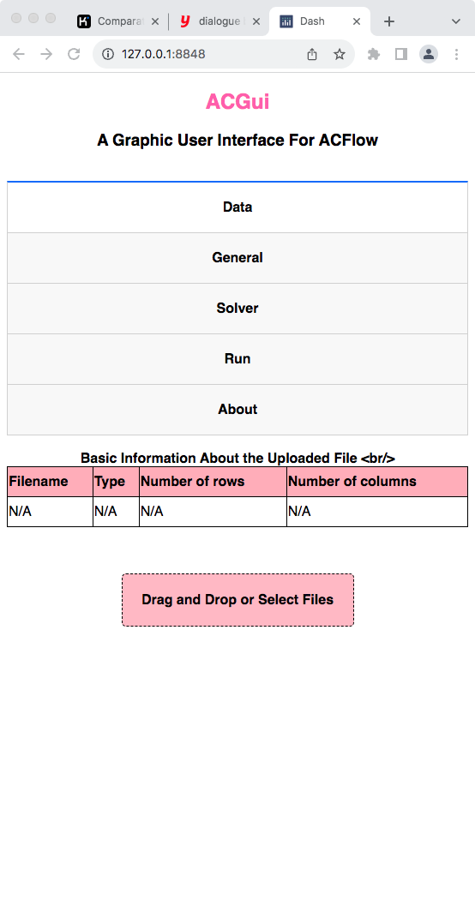
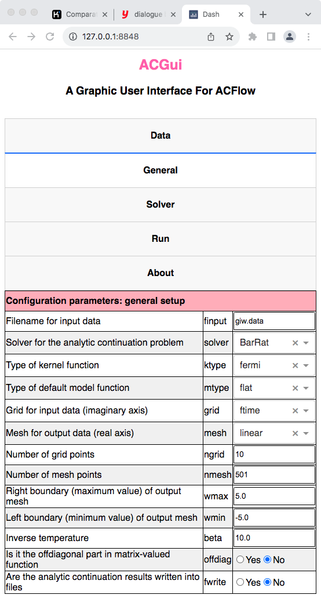
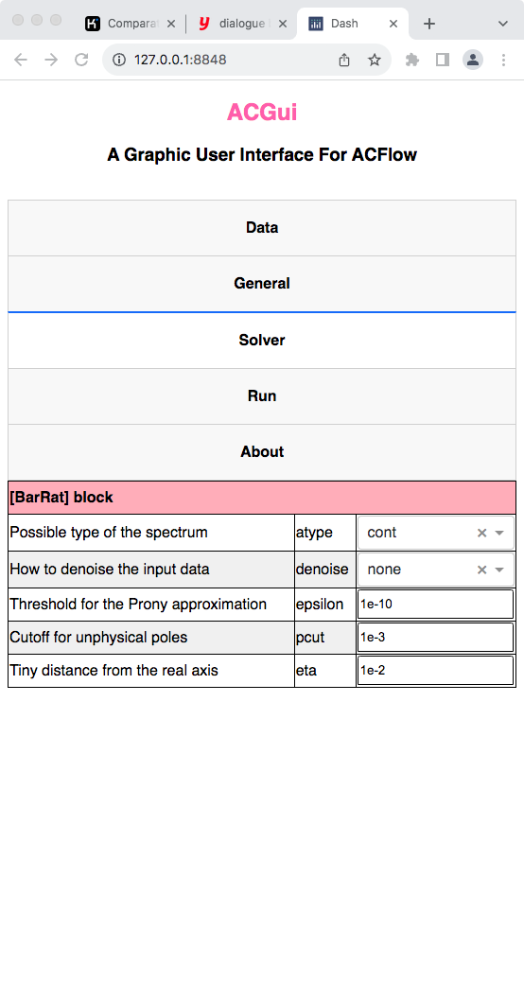

# Usage

It is quite easy to use `ACGui`.

---

## Launch ACGui

Suppose that the `ACGui` is placed in the folder `/home/your_home/acgui`, then we should execute the following command in the terminal to launch the server side of `ACGui`:

```shell
$ pwd
/home/your_home/acgui
$ ./util/acg.jl
[ Info: Listening on: 127.0.0.1:8848, thread id: 1
```

Next, we can use any favourite web browsers (such as Chrome, Edge, or Firefox) to open the following URL:

```text
http://127.0.0.1:8848
```

This is the client side of `ACGui`.

---

## Prepare input data

* Select the `Data` tab.
* Click `Drag and Drop or Select Files`.
* Choose a appropriate file that contains the necessary data.
* Click `Open` in the pop-up dialogue box.



**Figure 1 |** The `Data` tab in `ACGui`. 

---

## General setup

* Select the `General` tab.
* Fix filename for input data by `finput`.
* Choose suitable analytic continuation solver by `solver`.
* Fix other parameters.



**Figure 2 |** The `General` tab in `ACGui`.

---

## Analytic continuation solver

* Select the `Solver` tab.
* Customize the parameters for the solver. 



**Figure 3 |** The `Solver` tab in `ACGui`.

---

## Run

* Select the `Run` tab.
* Click `Start Analytic Continuation` to start calculation. After a few seconds or minites or hours (it depends on the solver you used), the spectrum will be shown in the bottom of this tab.
* Click `Get ac.toml only` to download the generated `ac.toml` file. Later you can modify it and start analytic continuation calculation manually.
* Click `Check err.out` to check the `err.out` file if available. If `ACFlow` encounters something wrong, it will dump the error message into `err.out`.


**Figure 4 |** The `Run` tab in `ACGui`.
